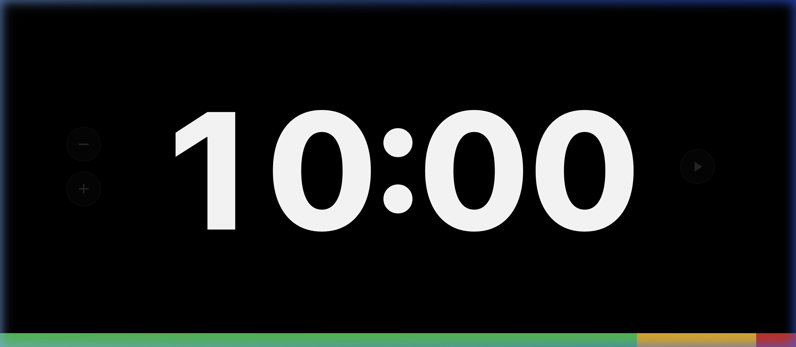

# Conference Timer 🕒

A professional, distraction-free countdown timer designed specifically for conference speakers, presenters, and organizers. 

Built with a focus on high visibility and simplicity, this tool ensures your sessions stay on track without the clutter of ads or complex configurations.

[**🚀 Live Demo**](https://sylphlin.github.io/conference-timer/)

## Why Conference Timer?

- **Stage-Ready Visibility**: Massive, high-contrast typography and a 4vh thickened progress bar that can be easily seen from the back of any hall.
- **Zero Distractions**: No ads, no pop-ups, and no secondary functions. Purely focused on time.
- **Privacy First**: Runs entirely in your browser. No data leaves your machine.
- **Portable**: A single `index.html` file. No installation or internet connection required (after initial load).

## Key Features

- **Proportional Progress Bar**: A tricolor bar (Green-Yellow-Red) that dynamically scales to your total time.
  - **Green**: Safe zone (> 1 minute).
  - **Yellow**: Warning zone (15s to 1 minute).
  - **Red**: Critical zone (< 15s).
- **Overtime Mode**: Automatically switches to an elapsed time counter (`+MM:SS`) with a 1Hz red flash after reaching zero.
- **Quick Setup (URL Params)**: Use `?t=XmYs` (e.g., `?t=15m30s`) to set the duration instantly via the URL.
- **Direct Interaction**: 
  - Click digits to edit the time inline.
  - Sidebar controls for quick adjustments (+/- 1 minute).
  - One-click `Reset` to restore initial duration.
- **Responsive Design**: Adapts perfectly to projectors, laptops, and mobile screens.

## Quick Start

1. Download the `index.html` file.
2. Open it in any modern web browser.
3. (Optional) Append `?t=20m` to the URL to set a 20-minute countdown.

## Keyboard Shortcuts

- **Space**: Start / Pause
- **Enter**: Confirm time during inline editing
- **Esc**: Cancel inline editing

## Tech Stack

- **Vanilla JavaScript (ES6+)**: High performance, zero dependencies.
- **Vanilla CSS**: Responsive layout with dynamic `clamp()` typography.
- **SVG Icons**: Lightweight and sharp at any scale.

## License

MIT License - feel free to use, modify, and distribute!
